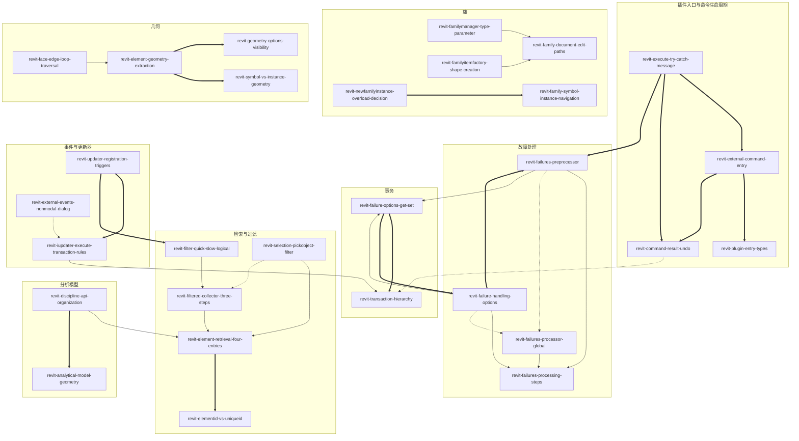
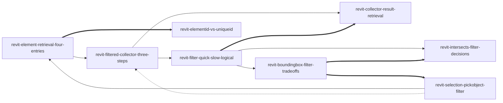
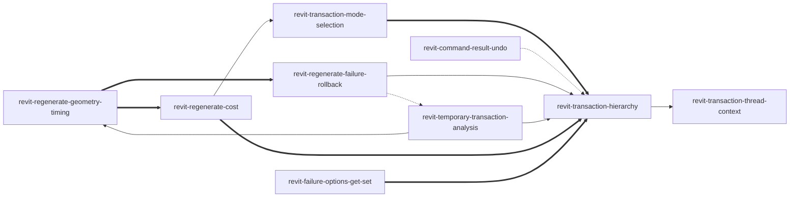
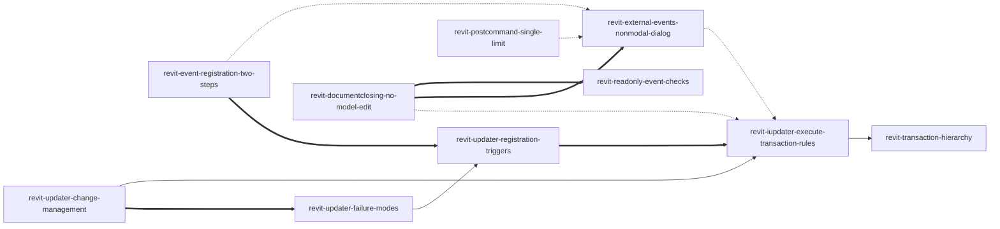
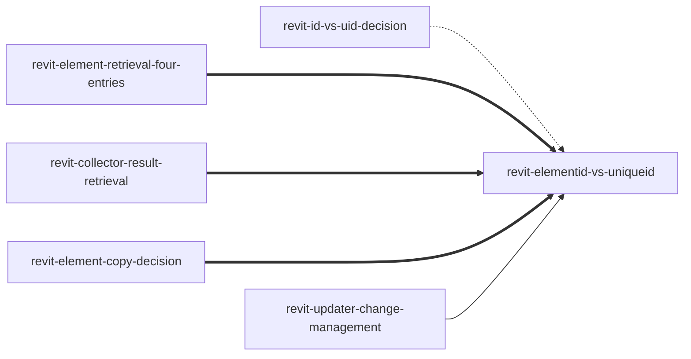

# 《API开发指南 Autodesk Revit》 — Skill Index

> 本书由 cangjie-skill 蒸馏, 共产出 **159** 个 skills。
> 处理时间: 2026-08-28

## 关于这本书

- **作者**: 宦国胜
- **出版年**: 2016（中国水利水电出版社）
- **一句话主旨**: Revit 二次开发的 API 全指南——对象模型、过滤、事务、事件、族、几何、数据存储、工作共享等八大域的编程方法论
- **整书理解**: 见 [BOOK_OVERVIEW.md](../BOOK_OVERVIEW.md)
- **术语词典**: [GLOSSARY.md](./GLOSSARY.md)

---

## Skill 列表 (按主题分组)

### A. 插件架构与命令入口

- [`revit-plugin-entry-types`](./revit-plugin-entry-types/SKILL.md) — 新建插件或 .addin 加载失败时，选 IExternalCommand / IExternalApplication / IExternalDBApplication 的入口决策
- [`revit-transaction-mode-selection`](./revit-transaction-mode-selection/SKILL.md) — 给命令类加 [Transaction(TransactionMode.XXX)] 特性时，Automatic / Manual / ReadOnly 三模式的选择
- [`revit-indexed-property-get-set`](./revit-indexed-property-get-set/SKILL.md) — 书中索引型属性（如 Element.Geometry）写成 C# 属性访问导致编译失败时，改用 get_/set_ 方法
- [`revit-external-command-entry`](./revit-external-command-entry/SKILL.md) — 写"被按钮触发、执行一次"的命令功能时，Execute 签名与 IExternalCommand 实现
- [`revit-execute-try-catch-message`](./revit-execute-try-catch-message/SKILL.md) — 插件命令弹"未处理的异常"时，Execute 的 try-catch-finally 与发布版消息规范
- [`revit-command-app-loading-timing`](./revit-command-app-loading-timing/SKILL.md) — 需要"启动时自动执行"却只写了外部命令时，命令与应用的加载时机区分
- [`revit-execute-parameter-semantics`](./revit-execute-parameter-semantics/SKILL.md) — 写 Execute 方法时，commandData / message / elements 三参数的分工
- [`revit-command-result-undo`](./revit-command-result-undo/SKILL.md) — 问"返回 Failed 会不会撤销修改"时，Result 取值与修改保留/回滚语义
- [`revit-command-availability`](./revit-command-availability/SKILL.md) — 要让按钮"选中墙才可点、否则灰显"时，IExternalCommandAvailability 实现
- [`revit-startup-shutdown-events`](./revit-startup-shutdown-events/SKILL.md) — 写 IExternalApplication 时，OnStartup 订阅事件 / OnShutdown 注销的配对规则
- [`revit-db-application-scenarios`](./revit-db-application-scenarios/SKILL.md) — 需要无 UI 后台服务（文档打开自动检查、挂更新器）时，IExternalDBApplication 的适用场景
- [`revit-command-state-persistence`](./revit-command-state-persistence/SKILL.md) — 命令执行完上次的状态怎么保存：Execute 返回即销毁，状态持久化方案

### B. 事务与重生成

- [`revit-transaction-hierarchy`](./revit-transaction-hierarchy/SKILL.md) — 组织多个模型修改时，Transaction / SubTransaction / TransactionGroup 三件套的层级选择
- [`revit-regenerate-geometry-timing`](./revit-regenerate-geometry-timing/SKILL.md) — 创建/修改图元后立即读几何或分析模型时，先 Regenerate 的时机规则
- [`revit-failure-options-get-set`](./revit-failure-options-get-set/SKILL.md) — 配置某个事务的故障处理：FailureHandlingOptions 无法 new，必须 Get→修改→Set
- [`revit-transaction-thread-context`](./revit-transaction-thread-context/SKILL.md) — 在后台线程或非模态对话框写模型时，事务只能从受支持工作流启动的规则
- [`revit-regenerate-failure-rollback`](./revit-regenerate-failure-rollback/SKILL.md) — Regenerate() 抛 RegenerationFailedException 或事务陷入半完成状态时的恢复
- [`revit-transaction-off-thread`](./revit-transaction-off-thread/SKILL.md) — 反例：从后台线程/非模态对话框外启动事务，识别与修复
- [`revit-temporary-transaction-analysis`](./revit-temporary-transaction-analysis/SKILL.md) — 做假设分析（what-if）时：临时改模型、提取信息、再回滚
- [`revit-regenerate-cost`](./revit-regenerate-cost/SKILL.md) — 批量修改性能优化：Regenerate() 高成本，应合并到大事务、只在必要处重生成

### C. 图元检索与过滤

- [`revit-element-retrieval-four-entries`](./revit-element-retrieval-four-entries/SKILL.md) — 需要"拿到图元"时的四入口决策：已知单个用 GetElement、批量同类用 Collector、交互用拾取
- [`revit-filtered-collector-three-steps`](./revit-filtered-collector-three-steps/SKILL.md) — 构造 FilteredElementCollector 的"三步构建"：新建 → 过滤 → 获取
- [`revit-filter-quick-slow-logical`](./revit-filter-quick-slow-logical/SKILL.md) — 挑过滤器按三类组合：QuickFilter 永远先行缩小集合，SlowFilter 最后
- [`revit-collector-result-retrieval`](./revit-collector-result-retrieval/SKILL.md) — 过滤后按用途选获取方式：存在性、计数、遍历各用不同 API
- [`revit-boundingbox-filter-tradeoffs`](./revit-boundingbox-filter-tradeoffs/SKILL.md) — 按空间范围检索时，BoundingBox 过滤器（快但粗）与精确判断的取舍
- [`revit-intersects-filter-decisions`](./revit-intersects-filter-decisions/SKILL.md) — 几何级精确相交判断（碰撞/干扰检查）用 ElementIntersects 系列过滤器
- [`revit-selection-pickobject-filter`](./revit-selection-pickobject-filter/SKILL.md) — 用户交互式选图元：当前选集 Selection 与 PickObject/PickBox 拾取
- [`revit-view-vs-document-collector`](./revit-view-vs-document-collector/SKILL.md) — Collector 先做视图级 vs 文件级决策：视图级只查可见图元

### D. 文档导航与图元基础

- [`revit-document-function-map`](./revit-document-function-map/SKILL.md) — 把 Document 当作功能域聚合体导航 API：类型/视图/图元/文件/事件/设置
- [`revit-element-six-groups`](./revit-element-six-groups/SKILL.md) — 按功能六组预判图元 API：Model、Sketch、View、Group、Annotation、其他
- [`revit-location-type-decision`](./revit-location-type-decision/SKILL.md) — 操作图元位置前先判 Location 四分类型：Curve / Point / Rotate / Move
- [`revit-element-move-decision`](./revit-element-move-decision/SKILL.md) — 移动图元按三条路径：批量平移 / 曲线驱动 / Location 直改
- [`revit-element-copy-decision`](./revit-element-copy-decision/SKILL.md) — 复制图元按目标域四选一：同文档 / 跨文档 / 跨视图 / 变换复制
- [`revit-category-family-symbol-instance`](./revit-category-family-symbol-instance/SKILL.md) — 用类型-实例四层模型导航：Category→Family→FamilySymbol→FamilyInstance
- [`revit-elementid-vs-uniqueid`](./revit-elementid-vs-uniqueid/SKILL.md) — 图元双 ID：ElementId（整数，项目内唯一、快）vs UniqueId（全局 GUID、可持久化）
- [`revit-document-vs-uidocument`](./revit-document-vs-uidocument/SKILL.md) — UI 层与 DB 层严格分离：界面操作必须经 UIDocument，模型走 Document
- [`revit-moveelement-z-coordinate-trap`](./revit-moveelement-z-coordinate-trap/SKILL.md) — MoveElement 对基于标高的图元静默忽略 Z 分量的陷阱
- [`revit-id-vs-uid-decision`](./revit-id-vs-uid-decision/SKILL.md) — 附录术语版双 ID 决策：外部数据库/BIM 协同时该存哪个 ID

### E. 视图

- [`revit-command-visibility-mode`](./revit-command-visibility-mode/SKILL.md) — 按文档类型或专业控制外部命令可见性的 .addin 声明式配置
- [`revit-view-classification-paths`](./revit-view-classification-paths/SKILL.md) — 分类/遍历/识别视图类型的三条并行分类路径
- [`revit-3d-view-creation-flow`](./revit-3d-view-creation-flow/SKILL.md) — API 创建三维视图（透视/等轴测）并控制剖面框/裁剪框的流程
- [`revit-2d-view-creation-paths`](./revit-2d-view-creation-paths/SKILL.md) — API 创建平面/剖面/详图/索引/立面/图纸视图的路径
- [`revit-schedule-creation-flow`](./revit-schedule-creation-flow/SKILL.md) — API 创建明细表/材料提取/图纸列表并配置字段/分组/过滤
- [`revit-level-no-auto-view`](./revit-level-no-auto-view/SKILL.md) — API 创建标高后发现没有对应平面视图：API 与 UI 隐式行为差异

### F. 族

- [`revit-family-three-layer-model`](./revit-family-three-layer-model/SKILL.md) — 族、族符号、族实例三层模型的包含/从属结构与互相导航
- [`revit-family-symbol-instance-navigation`](./revit-family-symbol-instance-navigation/SKILL.md) — 走"族↔符号↔实例"三层导航：正向创建、反向溯源、符号互换
- [`revit-system-vs-component-family`](./revit-system-vs-component-family/SKILL.md) — 系统族与构件族的区分：墙/楼板能否用 API 加载或编辑族文件
- [`revit-instance-flip-state-check`](./revit-instance-flip-state-check/SKILL.md) — 翻转族实例朝向/把手/工作平面时 flip 状态检查与部分失败排查
- [`revit-instance-rotate-location-type`](./revit-instance-rotate-location-type/SKILL.md) — 把族实例旋转任意角度、批量移动点状/线状构件时的 Location 类型
- [`revit-instance-host-subcomponent-navigation`](./revit-instance-host-subcomponent-navigation/SKILL.md) — 拿实例的宿主、展开嵌套族找子构件、Host 返回 null 的处理
- [`revit-newfamilyinstance-overload-decision`](./revit-newfamilyinstance-overload-decision/SKILL.md) — NewFamilyInstance 放置构件时用哪个重载、实例 3D 显示异常的排查
- [`revit-family-document-edit-paths`](./revit-family-document-edit-paths/SKILL.md) — 新建族文件、代码直接编辑 .rfa、EditFamily/LoadFamily 的路径选择
- [`revit-familyitemfactory-shape-creation`](./revit-familyitemfactory-shape-creation/SKILL.md) — 族文件中创建拉伸/放样等三维形状，document.Create 的族文档限定
- [`revit-family-element-visibility`](./revit-family-element-visibility/SKILL.md) — 族内图元按视图类型（平面/3D）与详细程度（粗/中/细）控制显隐
- [`revit-familymanager-type-parameter`](./revit-familymanager-type-parameter/SKILL.md) — 给族添加类型/共享参数、公式驱动、新增族类型，改后项目实例不更新的处理
- [`revit-referencepoint-curvebypoints`](./revit-referencepoint-curvebypoints/SKILL.md) — 概念设计/体量环境中创建参照点、用点创建曲线/形状
- [`revit-conceptual-forms-type-selection`](./revit-conceptual-forms-type-selection/SKILL.md) — 体量/概念设计环境创建拉伸、旋转、放样、融合、表面形状的类型选择
- [`revit-loadfamilysymbol-preference`](./revit-loadfamilysymbol-preference/SKILL.md) — 按需加载单个族符号省内存；LoadFamily 第二次返回 false 的处理
- [`revit-newfamilyinstances-batch-create`](./revit-newfamilyinstances-batch-create/SKILL.md) — 一次创建大量同类型族实例（如 1000 个柱）的批量提速
- [`revit-model-vs-reference-line`](./revit-model-vs-reference-line/SKILL.md) — 创建形状后原轮廓线消失、想让形状参数化跟随驱动线的模型线/参照线选择

### G. 几何

- [`revit-element-transform-utils`](./revit-element-transform-utils/SKILL.md) — 构件几何变换（旋转/镜像/阵列/对齐/成组/删除/固定）调 ElementTransformUtils 的哪个 API
- [`revit-element-geometry-extraction`](./revit-element-geometry-extraction/SKILL.md) — 从 Element 提取几何（Solid/Faces/Edges/Curve）算量的标准路径
- [`revit-face-edge-loop-traversal`](./revit-face-edge-loop-traversal/SKILL.md) — 把 Face 边界导出为闭合曲线环（DXF 外轮廓等）的遍历方法
- [`revit-symbol-vs-instance-geometry`](./revit-symbol-vs-instance-geometry/SKILL.md) — 用 GetInstanceGeometry 的几何面创建基于面的族/尺寸失败：副本几何无有效 Reference
- [`revit-family-instance-no-geometryinstance`](./revit-family-instance-no-geometryinstance/SKILL.md) — 遍历族实例几何时顶层拿到 Solid 而非 GeometryInstance 的情形
- [`revit-reference-intersector-raycast`](./revit-reference-intersector-raycast/SKILL.md) — 光线投影（垂直测距、遮挡检查、光线路径追踪）用 ReferenceIntersector
- [`revit-geometry-utility-classes`](./revit-geometry-utility-classes/SKILL.md) — 几何实用操作选哪个工具类：取特定面 / 拆分 / 布尔 / 偏移
- [`revit-sketch-sketchplane-model`](./revit-sketch-sketchplane-model/SKILL.md) — 程序化绘制模型曲线/轮廓（任意平面）或编辑草图轮廓时 Sketch/SketchPlane
- [`revit-geometry-options-visibility`](./revit-geometry-options-visibility/SKILL.md) — 几何提取缺东西（缺中心平面/隔热层、梁楼梯只有粗轮廓）时查 Options 四属性
- [`revit-reference-stable-handle`](./revit-reference-stable-handle/SKILL.md) — 长期持有几何句柄（跨会话恢复拾取的面、序列化存盘再还原）的 Reference 稳定表示

### H1. 建筑构件（墙 / 板 / 洞口 / 轴网）

- [`revit-wall-location-line`](./revit-wall-location-line/SKILL.md) — 创建/修改墙体关心定位线时，WALL_KEY_REF_PARAM 整型 0–5 与位移量计算
- [`revit-wall-create-overloads`](./revit-wall-create-overloads/SKILL.md) — 创建墙不确定用哪个 Wall.Create 重载时的选择框架
- [`revit-floor-foundation-creation`](./revit-floor-foundation-creation/SKILL.md) — 创建楼板/基础板报错或不知入口时，FloorType.IsFoundationSlab 判别根
- [`revit-compound-structure-layers`](./revit-compound-structure-layers/SKILL.md) — 读取/修改墙/楼板/屋顶类型的复合层结构（CompoundStructure）
- [`revit-opening-boundary-reading`](./revit-opening-boundary-reading/SKILL.md) — 读取洞口几何边界：先读 IsRectBoundary 再分矩形/曲线两路
- [`revit-new-opening-overloads`](./revit-new-opening-overloads/SKILL.md) — 创建洞口选 NewOpening 重载：入口由"主体类型"决定
- [`revit-grid-curve-creation`](./revit-grid-curve-creation/SKILL.md) — 创建或读取轴网：IsCurved 为 true 时 Curve 是 Arc，false 是 Line
- [`revit-wall-structural-usage-rules`](./revit-wall-structural-usage-rules/SKILL.md) — 创建墙时结构用法与房间边界如何被推导的规则
- [`revit-foundation-host-deletion`](./revit-foundation-host-deletion/SKILL.md) — 批量删除楼板后出现"孤立基础"：宿主-基础关系不在删除级联内
- [`revit-new-opening-constraints`](./revit-new-opening-constraints/SKILL.md) — NewOpening 抛异常时：竖井洞口标高约束与墙洞口坐标约束
- [`revit-dimension-identification`](./revit-dimension-identification/SKILL.md) — 识别/遍历尺寸：API 无直接子类型，须 Curve 形状 × References 数量组合推断

### H2. 空间系统与分析模型（材料 / 房间 / 楼梯 / 部件）

- [`revit-material-access-creation`](./revit-material-access-creation/SKILL.md) — 编程检索、创建或复制材料，为材料挂接结构/热工属性资源
- [`revit-material-retrieval-fallback`](./revit-material-retrieval-fallback/SKILL.md) — 确定图元实际使用的材料：图元参数→类别回退→复合结构层→StructuralMaterialId
- [`revit-stairs-object-model`](./revit-stairs-object-model/SKILL.md) — 访问楼梯构件（梯段/平台/支撑/栏杆），判断"按构件"还是"按草图"
- [`revit-room-creation-boundary`](./revit-room-creation-boundary/SKILL.md) — 创建房间、放置到平面环、检索房间边界段的两段式创建
- [`revit-to-from-room-semantics`](./revit-to-from-room-semantics/SKILL.md) — 判断门/窗两侧各属于哪个房间：ToRoom/FromRoom 双向动态属性
- [`revit-room-volume-enable`](./revit-room-volume-enable/SKILL.md) — Room.Volume 返回 0 时：体积计算是文档级全局开关
- [`revit-stairs-edit-scope-isolation`](./revit-stairs-edit-scope-isolation/SKILL.md) — 反例：StairsEditScope 会话内调 Railing.Create 失败的编辑范围隔离
- [`revit-discipline-api-organization`](./revit-discipline-api-organization/SKILL.md) — 规划跨规程（建筑/结构/MEP）通用插件时，用图元类/分析层/拓扑/规程设置四维导航
- [`revit-analytical-model-geometry`](./revit-analytical-model-geometry/SKILL.md) — 读取结构图元（基础/柱/梁/墙/板）的分析位置几何
- [`revit-analytical-model-supports`](./revit-analytical-model-supports/SKILL.md) — 查询结构图元的支撑信息：按图元类型选查询方向
- [`revit-analytical-model-guard-clause`](./revit-analytical-model-guard-clause/SKILL.md) — 原则：调分析模型 GetPoint/GetCurve 前必须先判 IsSinglePoint/IsSingleCurve
- [`revit-analytical-link-hub`](./revit-analytical-link-hub/SKILL.md) — 原则：AnalyticalLink.Create 的参数是 Hub 的 ElementId 而非图元 Id
- [`revit-analytical-model-exception`](./revit-analytical-model-exception/SKILL.md) — 反例：拿到 AnalyticalModel 不判定形状直接取几何导致异常
- [`revit-beamsystem-analytical-absence`](./revit-beamsystem-analytical-absence/SKILL.md) — 反例：在 BeamSystem 自身上找 AnalyticalModel 失败——聚合图元不直接暴露
- [`revit-assembly-part-modeling`](./revit-assembly-part-modeling/SKILL.md) — 构造建模：创建部件（Assembly）、部件视图、把图元分割为零件（Part）
- [`revit-partmaker-term`](./revit-partmaker-term/SKILL.md) — 术语：PartUtils.CreateParts 不直接创建零件，而是实例化 PartMaker 工厂图元

### I. MEP（水暖电）

- [`revit-mep-curve-creation-entries`](./revit-mep-curve-creation-entries/SKILL.md) — 创建管道/风管/软管按"两点/两连接件/一点一连接件"三入口选型
- [`revit-mep-connector-system-topology`](./revit-mep-connector-system-topology/SKILL.md) — 遍历 MEP 系统：ConnectorManager→Connector→AllRefs 递归下游拓扑
- [`revit-mep-diameter-param`](./revit-mep-diameter-param/SKILL.md) — 原则：Pipe.Diameter 等 MEP 几何属性只读，修改尺寸必须走内建参数

### J. 参数与数据存储

- [`revit-parameter-index-lookup`](./revit-parameter-index-lookup/SKILL.md) — 多语言环境、共享/族/内置参数混用时检索参数的方法
- [`revit-settings-api-mapping`](./revit-settings-api-mapping/SKILL.md) — 程序化读取或修改项目级配置（材料、单位、阶段、类别、项目信息）
- [`revit-data-storage-paths`](./revit-data-storage-paths/SKILL.md) — 在图元上存自定义数据时，共享参数 vs 可扩展存储的选型
- [`revit-binding-type-vs-instance`](./revit-binding-type-vs-instance/SKILL.md) — 共享参数绑定到类别时，类型绑定 vs 实例绑定的选择
- [`revit-extensible-storage-pipeline`](./revit-extensible-storage-pipeline/SKILL.md) — 存结构化、版本化、权限控制的隐藏数据时的六步流水线
- [`revit-binding-insert-silent-fail`](./revit-binding-insert-silent-fail/SKILL.md) — 共享参数绑定操作可能失败时的防御性检查（静默失败）
- [`revit-shared-parameter-file-init`](./revit-shared-parameter-file-init/SKILL.md) — API 访问共享参数文件时的路径初始化或文件切换
- [`revit-schema-immutable-after-finish`](./revit-schema-immutable-after-finish/SKILL.md) — Schema 完成 Finish 后要改字段时：Schema 不可变的处理
- [`revit-builtin-parameter-semantics`](./revit-builtin-parameter-semantics/SKILL.md) — 跨语言稳定读写参数、几何属性只读需走内建参数写入的语义
- [`revit-schema-fieldbuilder-one-shot`](./revit-schema-fieldbuilder-one-shot/SKILL.md) — SchemaBuilder.Finish() 后再 AddSimpleField 报异常：一次性构建规则
- [`revit-shared-parameter-file-swap`](./revit-shared-parameter-file-swap/SKILL.md) — 插件载入自带共享参数文件而不影响用户原文件的三步切换法
- [`revit-shared-parameter-guid-check`](./revit-shared-parameter-guid-check/SKILL.md) — 复制带共享参数的图元后区分原始与副本、检查定义来源

### K. 事件与更新器（DMU）

- [`revit-documentclosing-no-model-edit`](./revit-documentclosing-no-model-edit/SKILL.md) — 在只读事件（DocumentClosing 等）回调中尝试修改模型的禁区
- [`revit-event-registration-two-steps`](./revit-event-registration-two-steps/SKILL.md) — 订阅/注销事件（DocumentChanged 等）的 handler 两步注册法
- [`revit-cancelable-events-propagation`](./revit-cancelable-events-propagation/SKILL.md) — 前置可取消事件（DocumentSaving 等）的参数与取消传播
- [`revit-external-events-nonmodal-dialog`](./revit-external-events-nonmodal-dialog/SKILL.md) — 非模态对话框/停靠面板要执行 Revit API 时用 ExternalEvent
- [`revit-iupdater-execute-transaction-rules`](./revit-iupdater-execute-transaction-rules/SKILL.md) — 编写 IUpdater.Execute()（DMU）内部逻辑：事务结束时触发的规则
- [`revit-updater-registration-triggers`](./revit-updater-registration-triggers/SKILL.md) — 让 IUpdater 生效：RegisterUpdater 注册 + 变更过滤器触发器
- [`revit-addincommandbinding-override-commands`](./revit-addincommandbinding-override-commands/SKILL.md) — 重写/拦截/禁用 Revit 内置命令：CreateAddInCommandBinding
- [`revit-postcommand-single-limit`](./revit-postcommand-single-limit/SKILL.md) — PostCommand 让插件触发内置命令（保存、打印）的硬限制
- [`revit-readonly-event-checks`](./revit-readonly-event-checks/SKILL.md) — 事件回调里要改模型前先查 Document.IsModifiable
- [`revit-updater-change-management`](./revit-updater-change-management/SKILL.md) — IUpdater 持久化图元引用（用 ElementId 持久化）与多更新器并存
- [`revit-iupdater-forbidden-api-list`](./revit-iupdater-forbidden-api-list/SKILL.md) — IUpdater.Execute() 禁入 API 清单（ViewSheet.AddView、LoadFamily 等）
- [`revit-updater-failure-modes`](./revit-updater-failure-modes/SKILL.md) — IUpdater 三类典型故障：无限循环 / 更新器冲突 / 禁入 API
- [`revit-analysis-results-refresh`](./revit-analysis-results-refresh/SKILL.md) — 分析可视化插件（SpatialFieldManager 能耗/结构着色）的结果刷新机制

### L. 故障处理

- [`revit-exception-types`](./revit-exception-types/SKILL.md) — Revit 专有异常继承体系（ApplicationApplicationException 下的专有异常）
- [`revit-failure-handling-options`](./revit-failure-handling-options/SKILL.md) — 按事务定制故障处理策略：五开关（ClearAfterRollback 等）
- [`revit-failure-definition-registration`](./revit-failure-definition-registration/SKILL.md) — 发布自定义故障给 Revit：OnStartup 注册到 FailureDefinitionRegistry
- [`revit-failures-processing-steps`](./revit-failures-processing-steps/SKILL.md) — 事务提交时故障处理流水线：预处理器 → FailuresProcessing → 处理器
- [`revit-failures-accessor`](./revit-failures-accessor/SKILL.md) — 故障处理三步中读故障、删警告、解决、删图元的 FailuresAccessor 方法族
- [`revit-failures-preprocessor`](./revit-failures-preprocessor/SKILL.md) — 给特定事务做故障预处理（压噪）：每事务最多一个预处理器
- [`revit-failures-processing-event`](./revit-failures-processing-event/SKILL.md) — 无 UI 自动故障处理：FailuresProcessing 事件在预处理器后触发
- [`revit-failures-processor-global`](./revit-failures-processor-global/SKILL.md) — 让插件接管 Revit 全部错误对话框：会话唯一 IFailuresProcessor
- [`revit-failure-severity`](./revit-failure-severity/SKILL.md) — 为自定义故障选严重程度：Warning / Error / DocumentCorruption 三级

### M. 性能与点云

- [`revit-performance-adviser-rules`](./revit-performance-adviser-rules/SKILL.md) — 注册/执行性能检查规则：PerformanceAdviser 兼规则注册中心+执行引擎
- [`revit-performance-adviser-rule-interface`](./revit-performance-adviser-rule-interface/SKILL.md) — 实现自定义性能检查规则 IPerformanceAdviserRule 的七方法
- [`revit-point-cloud-api`](./revit-point-cloud-api/SKILL.md) — 创建/访问/显示点云的两条路径：受支持格式客户端 API / 框架引擎
- [`revit-point-cloud-filter`](./revit-point-cloud-filter/SKILL.md) — 按空间范围过滤点云点：多平面过滤器的正半空间交集几何

### N. 工作共享

- [`revit-worksharing-api-decision-framework`](./revit-worksharing-api-decision-framework/SKILL.md) — 写工作共享插件的四步决策框架：IsWorkshared → 检出 → 修改 → 同步
- [`revit-open-workshared-file`](./revit-open-workshared-file/SKILL.md) — 编程打开中心文件并控制加载范围（分离/附着）
- [`revit-synchronize-with-central`](./revit-synchronize-with-central/SKILL.md) — 与中心同步的三个 API 分工：ReloadLatest / SynchronizeWithCentral / 保存
- [`revit-checkout-group-propagation`](./revit-checkout-group-propagation/SKILL.md) — CheckoutElements 后"实际检出了什么"：检出会向宿主/组传播
- [`revit-enableworksharing-irreversible`](./revit-enableworksharing-irreversible/SKILL.md) — 反例：EnableWorksharing 清除撤销历史，操作不可逆
- [`revit-serverpath-avoid`](./revit-serverpath-avoid/SKILL.md) — 构造指向 Revit Server 中心文件的 ModelPath 时不要用 ServerPath

### O. 链接与外部引用

- [`revit-link-decision-flow`](./revit-link-decision-flow/SKILL.md) — 判断图元是否引用外部文件、创建/加载/卸载链接、配置路径类型
- [`revit-transmissiondata-offline`](./revit-transmissiondata-offline/SKILL.md) — 不启动 Revit 批量读取/修改一批 .rvt 的链接路径与加载状态
- [`revit-link-reference-conversion`](./revit-link-reference-conversion/SKILL.md) — 链接文件拾取图元/面后在主体文件基于它工作：引用转换
- [`revit-external-file-reference-utils`](./revit-external-file-reference-utils/SKILL.md) — 查询图元的外部文件引用：IsExternalFileReference / GetExternalFileReference
- [`revit-nested-link-unload`](./revit-nested-link-unload/SKILL.md) — 处理多级嵌套链接（A→B→C）的加载/卸载，避免单独遍历卸载

### P. 导出

- [`revit-document-export-formats`](./revit-document-export-formats/SKILL.md) — 导出前按 13 种格式（gbXML/IFC/NWC/DWF/DWG…）选对入口
- [`revit-ifc-exporter-registration`](./revit-ifc-exporter-registration/SKILL.md) — 用自定义实现接管 IFC（或 Navisworks/几何）导出：IExporterIFC 注册
- [`revit-dwg-export-tables`](./revit-dwg-export-tables/SKILL.md) — Revit→CAD 导出满足公司图层/线型/填充标准：导出配置表
- [`revit-printable-view-check`](./revit-printable-view-check/SKILL.md) — 视图导出（DWG/DWF/PDF）前必查 View.CanBePrinted

### Q. UI（功能区与对话框）

- [`revit-ribbon-control-types`](./revit-ribbon-control-types/SKILL.md) — 功能区加控件：按钮/下拉/分割/单选组的类型选择与坑
- [`revit-ribbon-panel-layout`](./revit-ribbon-panel-layout/SKILL.md) — 设计功能区面板布局：最左侧大按钮=最常用命令等规则
- [`revit-taskdialog-component-rules`](./revit-taskdialog-component-rules/SKILL.md) — 写 TaskDialog 的规范：标题格式 / MainInstruction / 按钮组
- [`revit-taskdialog-vs-dialog`](./revit-taskdialog-vs-dialog/SKILL.md) — 弹窗选型：纯提示/确认/选择用 TaskDialog，复杂交互用自定义 Dialog

### R. 参数细节（单位与存储类型）

- [`revit-internal-units-conversion`](./revit-internal-units-conversion/SKILL.md) — API 读出数值"不对劲"（AsDouble 返回英尺）时：内部单位换算
- [`revit-parameter-storage-types`](./revit-parameter-storage-types/SKILL.md) — 参数读出来类型不对、ElementId 参数为负数：ParameterType 与 StorageType

---

## 引用图

全部 200 条关系（depends-on 66 / contrasts-with 47 / composes-with 87）中，出入度 ≥4 的 hub 节点共 30 个。下图为度最高的核心 hub（度 ≥5）及其关键桥接节点，按域分簇：



图例:
- `-->`  depends-on
- `-.->` contrasts-with
- `===>` composes-with

### 典型主题子图 ①：过滤器链



### 典型主题子图 ②：事务族



### 典型主题子图 ③：事件三角（订阅 / ExternalEvent / IUpdater）



### 典型主题子图 ④：双 ID 对比



图例（全部子图同上）: `-->` depends-on、`-.->` contrasts-with、`===>` composes-with。

---

## 推荐学习顺序

(从 depends-on 依赖图的被依赖端出发, 沿拓扑序前进; 每 stage 内按依赖先后排列)

### 阶段 1 — 地基：对象模型与插件入口

1. **revit-document-vs-uidocument** — UI/DB 双层分离是一切 API 调用的第一前提，无前置
2. **revit-plugin-entry-types** — 先定插件形态（命令/应用/DB 应用），后续所有入口问题都源于此
3. **revit-external-command-entry** — 依赖入口类型决策，落地 Execute 实现
4. **revit-transaction-mode-selection** — 命令写好后第一步就是配 TransactionMode 特性
5. **revit-document-function-map** — 依赖 document-vs-uidocument，用功能域地图导航 Document
6. **revit-element-six-groups** — 认识图元六大功能组，为检索/过滤打基础
7. **revit-elementid-vs-uniqueid** — 双 ID 是 5 个下游 skill（检索/复制/更新器）的共同前置

### 阶段 2 — 修改模型的前提：事务

1. **revit-transaction-thread-context** — 先懂"事务只能从受支持工作流启动"的边界
2. **revit-transaction-hierarchy** — 依赖线程上下文，全图最高 hub（入度 7），三件套层级
3. **revit-regenerate-geometry-timing** — 改完模型何时能读到新几何
4. **revit-regenerate-cost** — 依赖 TransactionMode（阶段 1），理解重生成的性能代价
5. **revit-command-result-undo** — Result 返回值与事务回滚的互动（与事务层级成对比关系）

### 阶段 3 — 检索与过滤

1. **revit-element-retrieval-four-entries** — "拿到图元"的总入口，被 collector/拾取共同依赖
2. **revit-filtered-collector-three-steps** — 依赖四入口，collector 三步构建
3. **revit-filter-quick-slow-logical** — 依赖三步构建，快/慢/逻辑过滤器排序
4. **revit-collector-result-retrieval** — 依赖三步构建，与快慢过滤组合使用，选对获取方式
5. **revit-selection-pickobject-filter** — 依赖四入口 + UIDocument（阶段 1），交互拾取路线

### 阶段 4 — 图元操作与族

1. **revit-location-type-decision** — 操作位置前先判 Location 四类型，被移动/旋转共同依赖
2. **revit-element-move-decision** — 依赖 Location 判型，三条移动路径
3. **revit-family-three-layer-model** — 族三层模型，族域一切导航的起点
4. **revit-system-vs-component-family** — 系统族 vs 构件族，被符号导航/族编辑共同依赖
5. **revit-family-symbol-instance-navigation** — 依赖三层模型 + 系统族区分，三层互走
6. **revit-newfamilyinstance-overload-decision** — 与符号导航组合，放置实例的重载选择
7. **revit-family-document-edit-paths** — 依赖系统族区分，进入 .rfa 编辑的世界
8. **revit-element-geometry-extraction** — 图元几何提取入口，被面环/实例几何/选项下游依赖

### 阶段 5 — 参数与数据存储

1. **revit-parameter-index-lookup** — 参数检索是读写一切参数的前置
2. **revit-builtin-parameter-semantics** — 跨语言稳定的内建参数读写语义
3. **revit-internal-units-conversion** — 英寸/毫米陷阱，写参数前必备
4. **revit-parameter-storage-types** — 与单位换算并列的另一个"数值不对"根因
5. **revit-binding-type-vs-instance** — 共享参数绑定的类型/实例选择
6. **revit-extensible-storage-pipeline** — 可扩展存储六步流水线，与绑定并列的存储路线
7. **revit-data-storage-paths** — 依赖绑定与可扩展存储两条路线，做总选型

### 阶段 6 — 故障处理

1. **revit-failure-options-get-set** — 事务级故障选项的 Get→改→Set（入度 2 的前置）
2. **revit-failures-processing-steps** — 全域最高入度 hub（入度 7）：故障处理三步流水线
3. **revit-failure-handling-options** — 依赖上面两者，五开关策略
4. **revit-failures-preprocessor** — 依赖选项与流水线，每事务预处理器
5. **revit-failures-processor-global** — 依赖流水线，全局接管（与预处理器成对比）
6. **revit-exception-types** — 异常体系，贯穿故障域的词汇表

### 阶段 7 — 事件、更新器与命令集成

1. **revit-event-registration-two-steps** — 事件订阅两步法，事件域入口
2. **revit-readonly-event-checks** — 事件回调改模型前先查 IsModifiable
3. **revit-external-events-nonmodal-dialog** — 非模态 UI 回主线程的标准通道
4. **revit-updater-registration-triggers** — 更新器注册 + 触发器，依赖事件与过滤知识
5. **revit-iupdater-execute-transaction-rules** — 依赖事务层级（阶段 2）+ 更新器注册，Execute 内规则
6. **revit-updater-change-management** — 依赖 IUpdater 规则 + 双 ID（阶段 1），持久化引用管理

### 阶段 8 — 工作共享、链接与导出

1. **revit-worksharing-api-decision-framework** — 工作共享总框架（配套同读 enableworksharing-irreversible 与 checkout-group-propagation 两个反例）
2. **revit-open-workshared-file** — 编程打开中心文件，框架的执行起点
3. **revit-synchronize-with-central** — 同步三 API 分工（配套同读 serverpath-avoid）
4. **revit-link-decision-flow** — 链接域总入口决策流
5. **revit-transmissiondata-offline** — 依赖嵌套链接语义，离线批量改链接
6. **revit-document-export-formats** — 13 种导出格式选型（配套同读 printable-view-check）

---

## 安装使用

本目录是构建产物, 宿主不会从这里加载 skill。要让 agent 真正调用, 把 skill 目录复制到宿主的 skills 目录:

```bash
# 用户级 (所有项目可用)
cp -r books/revit-api/revit-transaction-hierarchy ~/.claude/skills/

# 或项目级
cp -r books/revit-api/revit-transaction-hierarchy <project>/.claude/skills/    # Claude Code
cp -r books/revit-api/revit-transaction-hierarchy <project>/.cursor/skills/    # Cursor
```

(将 `revit-transaction-hierarchy` 替换为上方列表中任一需要的 skill slug, 可同时复制多个。)

---

## 接入 darwin-skill

所有 skill 均带有 `test-prompts.json` (darwin-skill 兼容格式), 可直接接入自动进化:

```
darwin evolve books/revit-api/
```

---

## 审计轨迹

- 候选单元池: [candidates/](../candidates/)
- 被淘汰的候选 (含原因): [rejected/](../rejected/)
- BOOK_OVERVIEW: [BOOK_OVERVIEW.md](../BOOK_OVERVIEW.md)
- 术语词典: [GLOSSARY.md](./GLOSSARY.md)
- 关系数据: [_stage3/relations-all.json](../../_stage3/relations-all.json) (200 条), 分组 [_stage3/group-slugs.json](../../_stage3/group-slugs.json)
